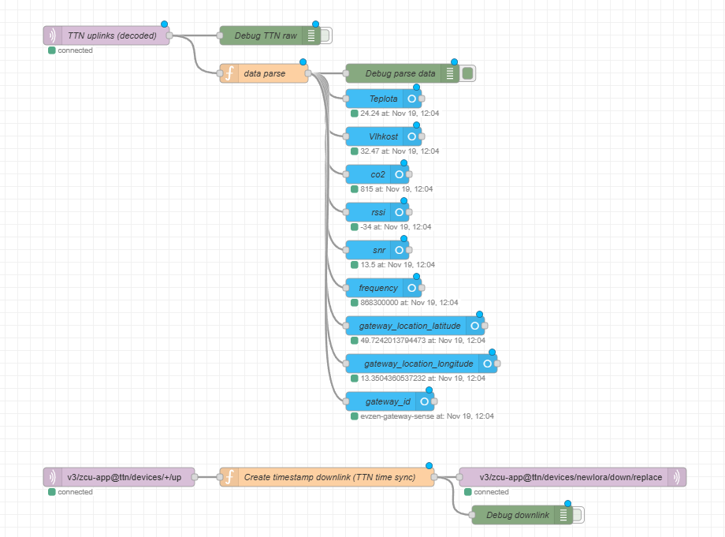

# Home Assistant LoRaWAN example (TTN → MQTT → Node-RED → Home Assistant)

This example shows how to integrate a **LocuSense LoRa sensing node** with  
**The Things Network (TTN)** and expose all important values as entities in  
**Home Assistant** via the **Node-RED add-on**.

Data path:

> Node → LoRaWAN → Gateway → TTN → MQTT → Node-RED → Home Assistant

The directory contains:

- `lora_ttn_ha_flow.json` – importable Node-RED flow file
- This README – step-by-step configuration notes

Example screenshots (optional, if you add them to the repo):

```text
docs/images/lora_nodered_flow.png        # Node-RED flow
docs/images/ha_lora_entities.png         # Home Assistant entities
```

You can then reference them in Markdown, e.g.:

```md


```


## 1. Prerequisites

- A running **Home Assistant** instance  
- **Node-RED add-on** installed and configured to talk to Home Assistant  
- **MQTT integration** in Home Assistant  
- An application + device registered in **The Things Network (TTN)** using **OTAA**  
- A LocuSense node configured for LoRaWAN uplinks (EU868 in this example)


## 2. TTN application & device setup

Recommended TTN settings (tested with this node):

- **Frequency plan:** `Europe 863–870 MHz (SF9 for RX2 – recommended)`
- **LoRaWAN version:** `LoRaWAN Specification 1.0.1`
- **Regional Parameters version:** `TS001 Technical Specification 1.0.1`

The device uses **OTAA**. In TTN you get:

- `AppEUI`
- `DevEUI`
- `AppKey`

On the node these values are written once in **CONFIG mode** using the serial console, e.g.:

```text
WIO SET APP_EUI <16-hex>
WIO SET DEV_EUI <16-hex>
WIO SET APP_KEY <32-hex>
SAVE
```

(replace placeholders with values from TTN).

### 2.1 Uplink payload format

In TTN go to **Payload formatters → Uplink → Javascript** and use the following decoder
for **FPort 8**:

```js
function Decoder(bytes, f_port) {
  var decoded = {};

  if (f_port === 8) {

    var temp_data = (bytes[0] << 8) | bytes[1];
    decoded.temperature = temp_data / 100;

    var hum_data = (bytes[2] << 8) | bytes[3];
    decoded.humidity = hum_data / 100;

    var co2_data = (bytes[4] << 8) | bytes[5];
    decoded.co2 = co2_data;

    return decoded;
  }

  return {};
}
```

This produces JSON like:

```json
{
  "temperature": 23.5,
  "humidity": 48.2,
  "co2": 731
}
```


## 3. MQTT connection from Home Assistant to TTN

In **Settings → Devices & services → Add integration**, add **MQTT** and point it to TTN:

- **Broker:** `eu1.cloud.thethings.network`
- **Port:** `1883`
- **Protocol:** MQTT v3.1.1
- **Username / password:** TTN MQTT credentials (for example, `YOUR_APP_ID` /
  `NNSXS.XXXX...` TTN API key – use your own values here, not these literals)

Other options can stay at defaults unless your setup requires something special.

This makes TTN MQTT traffic available to the **Node-RED add-on**, which uses the same broker settings via its MQTT config node.


## 4. Node-RED flow (import `lora_ttn_ha_flow.json`)

Open the **Node-RED add-on** in Home Assistant:

1. Open the menu → **Import**.
2. Paste or upload the contents of `lora_ttn_ha_flow.json`.
3. After import, double-click the **MQTT broker config node**  
   (`eu1.cloud.thethings.network`) and fill in your TTN username/password  
   (the same values you used in the MQTT integration).
4. Click **Deploy**.

If everything is configured correctly and the node is sending uplinks, the debug nodes
in the flow will start showing parsed data.


### 4.1 What the flow does

The flow is split into two logical parts:

#### A) Uplink → Home Assistant sensors

Top part of the flow:

- **`MQTT in (#)`**  
  Subscribes to all TTN topics on the broker.  
  (You can restrict this later to `v3/<your-app-id>@ttn/devices/+/up`.)

- **`data parse` function node**  
  Parses the TTN JSON structure, ignoring the special `EQ==` payload used for time
  synchronisation. It extracts:

  - `temperature`
  - `humidity`
  - `co2`
  - `rssi`
  - `snr`
  - `frequency`
  - `gateway_id`
  - `gateway_location.latitude`
  - `gateway_location.longitude`

  and keeps a small internal state so that if some metadata are missing in a specific
  packet, the last known values are reused instead of being erased.

- **Home Assistant sensor nodes (`ha-sensor`)**  
  Each value is mapped to a Home Assistant entity via
  `node-red-contrib-home-assistant-websocket`:

  - `sensor.lora_temperature` (°C)
  - `sensor.lora_humidity` (%)
  - `sensor.lora_co2` (ppm)
  - `sensor.lora_rssi` (dBm)
  - `sensor.lora_snr` (dB)
  - `sensor.lora_frequency` (Hz)
  - `sensor.lora_gateway_id`
  - `sensor.lora_gateway_latitude`
  - `sensor.lora_gateway_longitude`

These entities appear under the **“Node-RED Companion”** device in Home Assistant and
can be added to dashboards just like any other sensor.

#### B) Optional: time synchronisation downlink

The bottom part of the flow provides **automatic RTC time sync** for the node:

- **`MQTT in (v3/.../devices/+/up)`**  
  Listens for uplinks from the TTN application.

- **`create timestamp` function node**  

  - Checks if the device uplink payload (`frm_payload`) equals the special marker
    `EQ==`.
  - If yes, it creates a 4-byte big-endian **UNIX timestamp** (seconds), encodes it
    as base64, and builds a TTN downlink message on **FPort 8**.

- **`MQTT out (.../down/replace)`**  
  Publishes the downlink back to TTN.  
  The node firmware interprets this as “set RTC from the provided UNIX timestamp”.

If you don’t need automatic time synchronisation, you can disable or remove this
branch of the flow.


## 5. Verifying the entities in Home Assistant

After you deploy the flow and let the node send some packets:

1. Go to **Settings → Devices & services → Devices** in Home Assistant.
2. Open the device called **Node-RED Companion**.
3. You should see entities similar to:

   - `sensor.lora_co2`  
   - `sensor.lora_temperature`  
   - `sensor.lora_humidity`  
   - `sensor.lora_rssi`  
   - `sensor.lora_snr`  
   - `sensor.lora_frequency`  
   - `sensor.lora_gateway_id`  
   - `sensor.lora_gateway_latitude`  
   - `sensor.lora_gateway_longitude`

4. Use these entities in a dashboard – for example the “LoRa Dashboard” view that
   is used elsewhere in this project (gauge for CO₂, line graphs, etc.).


## 6. Customization notes

- You can safely restrict the MQTT input topic from `#` to:

  ```text
  v3/<your-app-id>@ttn/devices/+/up
  ```

- If you change the TTN **uplink decoder**, keep the JSON field names
  (`temperature`, `humidity`, `co2`) or update the `data parse` function accordingly.
- Entity names (`sensor.lora_*`) are defined in the Home Assistant entity config
  nodes and can be adapted to your own naming scheme.
- The flow is just an example – feel free to extend it with additional metrics,
  alerts, statistics or automations.
