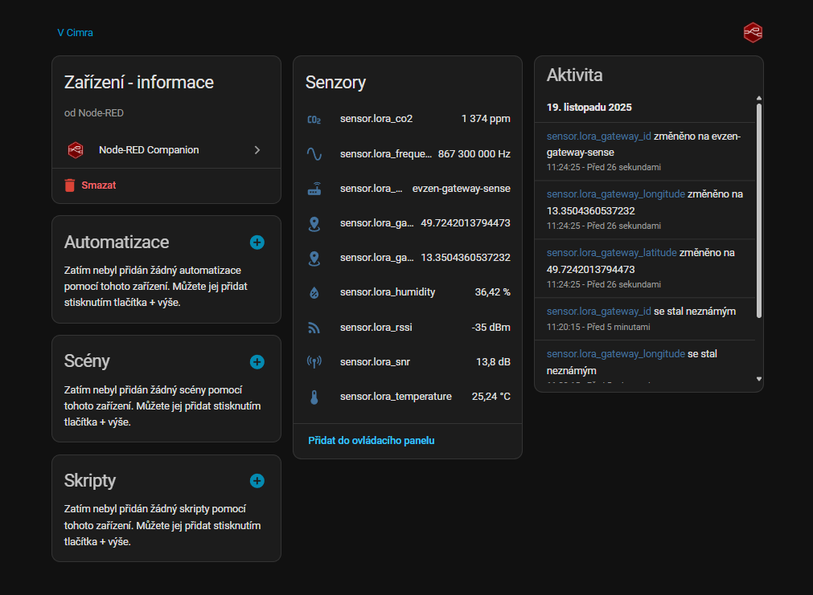

# Home Assistant LoRaWAN integration (TTN → MQTT → Node-RED)

This README documents the **LoRaWAN path** for LocuSense: from the Wio-E5 radio through
**The Things Network (TTN)** and **MQTT** to **Node-RED** and **Home Assistant**.

> For the Matter/Thread variant see [`home-assistant/matter/README.md`](../matter/README.md).
> Hardware, firmware and general project info live in the [root README](../../README.md).

## Contents

1. [Architecture overview](#1-architecture-overview)
2. [Requirements](#2-requirements)
3. [Configure the LocuSense node](#3-configure-the-locusense-node)
4. [Provision TTN application + device](#4-provision-ttn-application--device)
5. [Uplink payload formatter](#5-uplink-payload-formatter)
6. [Node-RED flow and MQTT topics](#6-node-red-flow-and-mqtt-topics)
7. [Home Assistant entities](#7-home-assistant-entities)
8. [Optional: time synchronisation via downlink](#8-optional-time-synchronisation-via-downlink)
9. [Tips and troubleshooting](#9-tips-and-troubleshooting)

---

## 1. Architecture overview

```text
LocuSense (Wio-E5) → LoRaWAN gateway → TTN → MQTT → Node-RED → Home Assistant
```

- Firmware sends compact 6-byte payloads containing temperature, humidity and CO₂.
- TTN decodes the payload and forwards uplinks over MQTT.
- Node-RED parses the message, enriches it with radio metadata and publishes entities via `node-red-contrib-home-assistant-websocket`.
- Home Assistant receives auto-discovered sensors that you can drop into dashboards.



---

## 2. Requirements

- Running **Home Assistant** (OS or Supervised) with the **Node-RED add-on** installed.
- An active **TTN account**, application and at least one registered device.
- **LoRaWAN gateway** connected to TTN (same frequency plan as your node).
- Basic familiarity with TTN Console, MQTT credentials, and Home Assistant entities.
- Tested parameters:
  - Frequency plan: `Europe 863-870 MHz (SF9 for RX2 - recommended)`
  - LoRaWAN version: `1.0.1`
  - Regional Parameters: `TS001 1.0.1`

---

## 3. Configure the LocuSense node

LocuSense uses **OTAA** (Over-The-Air Activation). Collect the following from TTN:

- `DevEUI` (16 hex)
- `AppEUI` / `JoinEUI` (16 hex)
- `AppKey` (32 hex)

Then program the Wio-E5 module via the configuration console:

1. Connect USB and open a serial terminal at `115200 8N1`.
2. Enter CONFIG mode (hold the front button for ~5 s while powering up).
3. Send the commands:

   ```text
   WIO SET DEV_EUI <16-hex>
   WIO SET APP_EUI <16-hex>
   WIO SET APP_KEY <32-hex>
   SAVE
   ```

4. Reboot. The device will join via OTAA and start periodic uplinks according to the measurement/timing profile configured in the STM32 firmware.

---

## 4. Provision TTN application + device

1. In **TTN Console**, create or reuse an Application.
2. Add a **new end device** with:
   - LoRaWAN 1.0.1 / TS001 1.0.1 parameters.
   - Frequency plan that matches your gateway and node (e.g. Europe 863‑870 MHz).
   - OTAA credentials matching what you flashed into the Wio-E5.
3. Once the device boots you should see join requests and periodic uplinks on **FPort 8** in the console.

---

## 5. Uplink payload formatter

The STM32 firmware emits a 6-byte payload on **FPort 8**:

| Bytes | Description             | Scaling |
|-------|-------------------------|---------|
| 0–1   | Temperature             | value / 100 → °C |
| 2–3   | Relative humidity       | value / 100 → % |
| 4–5   | CO₂ concentration       | ppm     |

Configure the TTN **Uplink formatter** (Javascript) for the application/device:

```js
function Decoder(bytes, f_port) {
  const decoded = {};

  if (f_port === 8) {
    const temp = (bytes[0] << 8) | bytes[1];
    decoded.temperature = temp / 100;

    const rh = (bytes[2] << 8) | bytes[3];
    decoded.humidity = rh / 100;

    const co2 = (bytes[4] << 8) | bytes[5];
    decoded.co2 = co2;
  }

  return decoded;
}
```

You can extend the formatter with additional metadata if your firmware sends more fields.

---

## 6. Node-RED flow and MQTT topics

Import `home-assistant/lora/lora_ttn_ha_flow.json` into the Node-RED add-on. The flow expects:

- **MQTT in** node subscribing to `v3/<APP_ID>@ttn/devices/+/up` with TTN API key credentials.
- Function nodes that:
  - decode the base64 payload (if you prefer decoding outside TTN),
  - merge radio metadata (RSSI, SNR, gateway info),
  - store the latest values in Node-RED context so partial updates keep previous readings.
- **Home Assistant sensor** nodes (`ha-sensor`) from `node-red-contrib-home-assistant-websocket` publishing entities.

Make sure the Home Assistant server configuration inside Node-RED points to your HA instance (URL, token).

---

## 7. Home Assistant entities

After deploying the flow you should see sensors such as:

- `sensor.lora_temperature` (°C)
- `sensor.lora_humidity` (%)
- `sensor.lora_co2` (ppm)
- `sensor.lora_rssi` / `sensor.lora_snr`
- Gateway diagnostics: ID, latitude, longitude, frequency

They appear under the Node-RED integration/device and can be added to Lovelace cards just like the Matter entities.

For dashboards you can reuse the same layout as the Matter view or build a dedicated “LoRa” tab comparing both data paths.

---

## 8. Optional: time synchronisation via downlink

The sample flow also demonstrates how to keep the STM32 **RTC** in sync without NTP:

1. The node sends a special uplink with payload `EQ==` (base64) whenever it needs the current time.
2. A Node-RED function (`create timestamp`) listens for that pattern on `v3/<APP_ID>@ttn/devices/+/up` and builds a 4-byte UNIX timestamp.
3. The flow publishes a downlink on `v3/<APP_ID>@ttn/devices/<DEVICE_ID>/down/replace` containing the timestamp.
4. LocuSense receives the downlink on the configured FPort and updates its RTC.

This piece is optional—remove the nodes if you prefer to keep the device fully autonomous.

---

## 9. Tips and troubleshooting

- **Uplinks visible in TTN but not in Node-RED**
  - Double-check the MQTT server (`eu1.cloud.thethings.network:1883` or your cluster).
  - Validate username/API key and topic (`v3/<APP_ID>@ttn/devices/+/up`).
- **Node-RED receives data but HA shows no sensors**
  - Open the debug nodes to confirm parsed payloads.
  - Check the Home Assistant server configuration in each `ha-sensor` node.
  - Ensure the add-on has the WebSocket API permission/token.
- **Sensor values stuck at 0 or null**
  - Verify the TTN formatter is enabled for uplinks.
  - Confirm the device transmits on **FPort 8** and that the payload length is 6 bytes.
- **No downlinks/time sync**
  - Make sure the flow publishes to `/down/replace` with the device ID, not `+/down`.
  - Check TTN fair-use policies to avoid rate limits.

Once the pieces are wired together you get a complete LoRaWAN → TTN → MQTT → Node-RED → Home Assistant pipeline that mirrors the functionality of the Matter integration, just over LPWAN.
