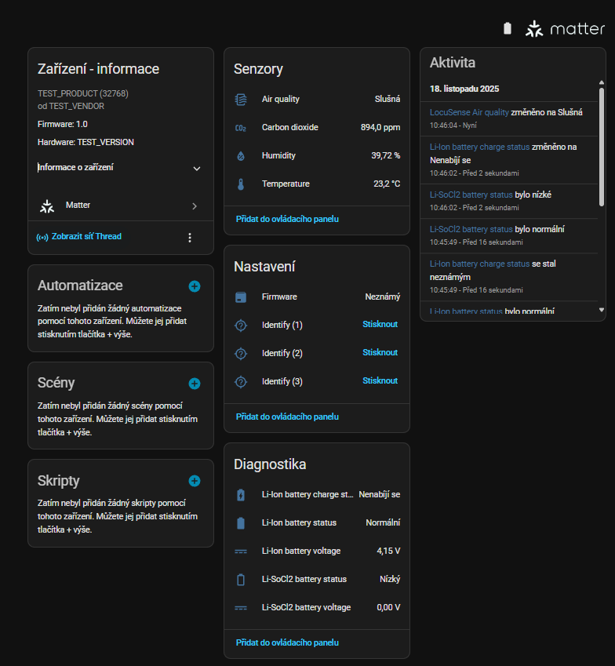
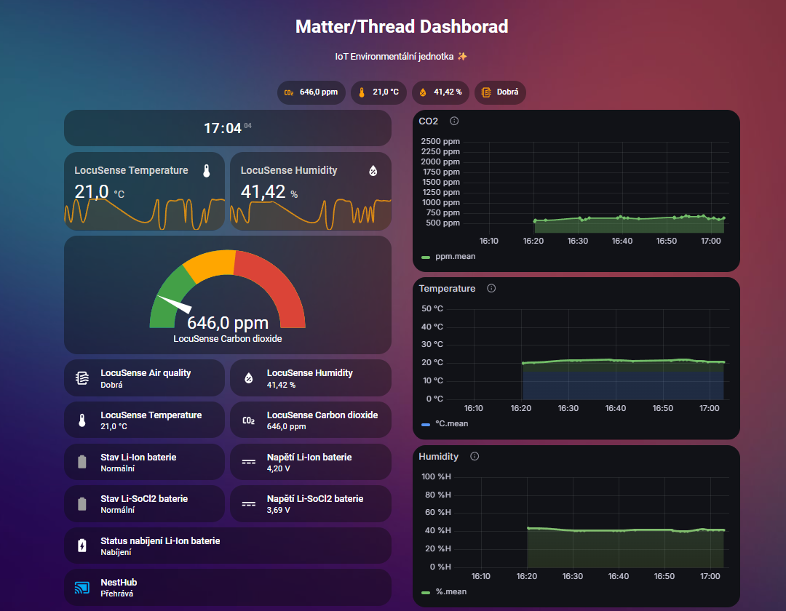

# Home Assistant integration (Matter over Thread)

This guide explains how to bring the **LocuSense environmental sensor** online as a
**Matter-over-Thread** device in Home Assistant, validate the exposed entities and
reuse the bundled dashboard + Grafana examples.

> ℹ️ LoRaWAN/TTN integration lives in [`home-assistant/lora/README.md`](../lora/README.md).
> The repository-wide overview and hardware details are covered in the [root README](../../README.md).

## Contents

1. [Prerequisites](#1-prerequisites)
2. [Create and verify a Thread network](#2-create-and-verify-a-thread-network)
3. [Commission the LocuSense Matter device](#3-commission-the-locusense-matter-device)
4. [Check the exposed entities](#4-check-the-exposed-entities)
5. [Build the Matter dashboard](#5-build-the-matter-dashboard)
6. [Feed data into InfluxDB and Grafana](#6-feed-data-into-influxdb-and-grafana)
7. [Embed Grafana panels back into Home Assistant](#7-embed-grafana-panels-back-into-home-assistant)
8. [Security best practices](#8-security-best-practices)
9. [Troubleshooting](#9-troubleshooting)

---

## 1. Prerequisites

Make sure you have:

- **Home Assistant OS / Supervised** (or another install with add-ons).
- A **Thread border router** such as **Home Assistant Connect ZBT-1** (aka SkyConnect) or
a certified Border Router with Thread 1.3 support.
- A LocuSense board with the **ESP32-C6 radio populated**, flashed with the Matter firmware
  (`firmware/esp32c6`).
- USB access to the device so you can enter CONFIG mode if you need to reprint the QR code.
- Optional but recommended add-ons:
  - **InfluxDB** for long-term storage of HA sensor data.
  - **Grafana** for historic charts and kiosk-style dashboards.
  - **Cloudflared** (or another secure tunnel/VPN) if you want remote access.

---

## 2. Create and verify a Thread network

1. Follow the official instructions for your border router (e.g. Connect ZBT-1 guide from Nabu Casa).
2. After onboarding, open **Settings → Devices & Services → Thread** in Home Assistant.
3. Confirm that:
   - The border router shows as **Online**.
   - At least one **Thread network** exists and is marked **Active**.
   - The ESP32-C6 node will be in radio range once powered.

If you already have a Thread network for other Matter devices you can reuse it—LocuSense will join as another sleepy end device.

---

## 3. Commission the LocuSense Matter device

The ESP32-C6 exposes LocuSense as a Matter environmental sensor with CO₂, temperature,
humidity, air-quality and dual-battery telemetry.

1. **Enter commissioning mode** on the device:
   - Hold the front button ≥5 s to enter CONFIG mode and run `ESP COMM START`, or
   - Use the console command `ESP QR` to redraw/print the QR pairing code.
2. In Home Assistant select **Settings → Devices & Services → Add Integration → Matter**.
3. Choose **Add Matter device**, then scan the on-device QR code (or enter the manual code).
4. Wait for onboarding to finish. A new device (the default name is the Matter product label, e.g. `Test product`) should appear with multiple entities.

> If pairing fails, long-press the button ≥30 s to reset the ESP32-C6 and try again.

---

## 4. Check the exposed entities

Entity IDs depend on your Matter setup, but you should see a structure similar to the following once the device is joined:

| Function                      | Example entity ID                          | Notes                              |
|-------------------------------|--------------------------------------------|------------------------------------|
| Temperature                   | `sensor.test_product_temperature`          | °C                                 |
| Relative humidity             | `sensor.test_product_humidity`             | %                                  |
| CO₂ concentration             | `sensor.test_product_carbon_dioxide`       | ppm                                |
| Air quality category/index    | `sensor.test_product_air_quality`          | Derived from CO₂                   |
| Li-Ion battery presence/fault | `binary_sensor.test_product_battery_5`     | See Power Source cluster mapping   |
| Li-Ion battery voltage        | `sensor.test_product_battery_voltage_5`    | V                                  |
| LiSOCl₂ battery presence      | `binary_sensor.test_product_battery_6`     | Backup battery state               |
| LiSOCl₂ battery voltage       | `sensor.test_product_battery_voltage_6`    | V                                  |
| Charge state (Li-Ion)         | `sensor.test_product_battery_charge_state` | Charging / Charged / No USB        |

Open **Settings → Devices & Services → [your device] → Entities** to confirm the exact IDs—these are the values you will reference in dashboards and automations.



---

## 5. Build the Matter dashboard

A ready-to-use Lovelace view lives in [`home-assistant/matter_dashboard.yaml`](../matter_dashboard.yaml). It shows:

- Current CO₂ / temperature / humidity / air quality tiles.
- Dual-battery status, charger state and sleep interval hints.
- Short-term mini-graphs for each quantity.
- Optional iframe cards for Grafana panels or a media player.

To import it:

1. In Home Assistant open the dashboard you want to customize.
2. Click **⋮ → Edit dashboard → Raw configuration editor**.
3. Paste the YAML from `matter_dashboard.yaml` and replace the `sensor.test_product_*` placeholders with your entity IDs.
4. Save and reload the dashboard.



---

## 6. Feed data into InfluxDB and Grafana

The dashboard YAML assumes you are optionally storing Home Assistant sensor data in **InfluxDB**
and visualizing it via **Grafana**. A common add-on configuration uses environment variables such as:

```yaml
env_vars:
  - name: GF_SECURITY_ALLOW_EMBEDDING
    value: "true"
  - name: GF_AUTH_ANONYMOUS_ENABLED
    value: "true"
  - name: GF_AUTH_ANONYMOUS_ORG_NAME
    value: Main Org.
  - name: GF_AUTH_ANONYMOUS_ORG_ROLE
    value: Viewer
  - name: GF_SERVER_ROOT_URL
    value: https://grafana.example.com/
  - name: GF_SERVER_SERVE_FROM_SUB_PATH
    value: "false"
  - name: GF_SECURITY_ADMIN_USER
    value: admin
  - name: GF_SECURITY_ADMIN_PASSWORD
    value: STRONG_PASSWORD
  - name: GF_AUTH_DISABLE_LOGIN_FORM
    value: "false"
  - name: GF_SECURITY_COOKIE_SECURE
    value: "true"
  - name: GF_SECURITY_COOKIE_SAMESITE
    value: none
plugins:
  - yesoreyeram-boomtheme-panel
custom_plugins: []
ssl: true
certfile: fullchain.pem
keyfile: privkey.pem
```

Pair this with an **InfluxDB** add-on configuration in `configuration.yaml` (not shown here) to log CO₂, temperature and humidity samples.

If you want remote access, add a Cloudflared tunnel similar to:

```yaml
external_hostname: home.example.com
additional_hosts:
  - hostname: grafana.example.com
    service: http://a0d7b954-grafana:3000
```

---

## 7. Embed Grafana panels back into Home Assistant

Once Grafana is reachable, embed specific panels back into your Lovelace view using either standard `iframe` cards or custom cards.
A minimal iframe card looks like:

```yaml
- type: iframe
  url: >-
    https://grafana.example.com/d-solo/YOUR_DASH_ID/your-panel
    ?orgId=1&panelId=1&from=now-1h&to=now&refresh=30s&kiosk=tv
  aspect_ratio: 45%
  card_mod:
    style: |
      :host {
        --ha-card-background: transparent;
      }
      ha-card {
        background: transparent !important;
        box-shadow: none !important;
      }
      ha-card > div,
      ha-card .card-content,
      ha-card iframe {
        background: transparent !important;
      }
```

Make sure Grafana allows embedding (`GF_SECURITY_ALLOW_EMBEDDING=true`) and that anonymous access or the chosen auth flow works inside the iframe.

---

## 8. Security best practices

- Rotate every default credential shown above (Grafana admin user, Cloudflared tokens, etc.).
- Use HTTPS certificates for any externally reachable endpoint (Grafana, Home Assistant, Cloudflared tunnel).
- Limit anonymous Grafana access to read-only dashboards or keep it disabled entirely.
- Treat the Home Assistant host as part of a trusted network segment or behind a VPN if you collect sensitive telemetry.

---

## 9. Troubleshooting

**Matter device not visible in Home Assistant**

- Verify the Thread network is online and the border router is powered.
- Ensure the node is still in commissioning mode (QR code valid, not already paired elsewhere).
- Remove the device from **Settings → Devices & Services → Matter** and re-add it.

**Entities have different names than the examples**

- Home Assistant generates entity IDs from the Matter descriptor; open the device page to copy the actual names.
- Update `matter_dashboard.yaml` (and any automations) with your IDs.

**Grafana iframe shows a blank card**

- Test the Grafana URL directly in a browser.
- Confirm the `GF_SECURITY_ALLOW_EMBEDDING` and `GF_AUTH_ANONYMOUS_ENABLED` settings.
- If using HTTPS, make sure the certificate chain is trusted by the device viewing the dashboard.

**InfluxDB stays empty**

- Inspect Home Assistant logs for the `influxdb` integration.
- Double-check host/port/database credentials in `configuration.yaml`.
- Verify that the add-on/container is running and that the retention policy matches your expectations.

With these steps the LocuSense Matter variant becomes a first-class Home Assistant sensor, complete with dashboards and history.
